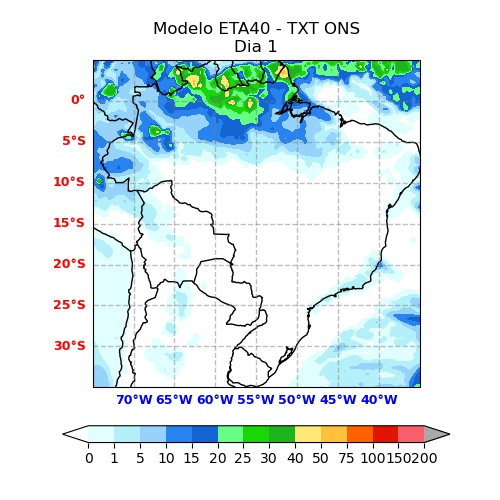
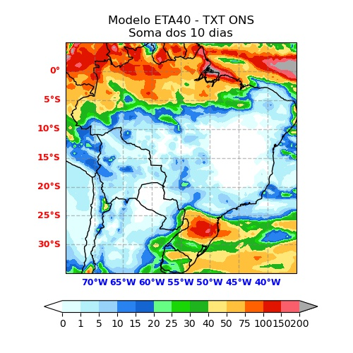

# mapLoaders
O projeto 'mapLoaders' tem por objetivo fornecer código para leitura de arquivos para uso no projeto 'plotMap'.
O código é livre (licença MIT) e conto com a colaboração de todos para o seu aperfeiçoamento.

   

## Utilização:

Em breve. Mas o arquivo 'mapLoaders_exemplos.py' pode lhe ajudar muito a como utilizar as funções do 'mapLoaders'

## Funções já implementadas:

### chuvaTxtONS :
Lê os dados de chuva prevista dos arquivos texto fornecidos pelo ONS (modelos ETA40, GEFS50 e ECMWF).

### chuvaCPTEC:
Lê os arquivos de precipitação prevista pelos modelos ETA e WRF do CPTEC (formatos grib-1 e grib-2, respectivamente). 

## Dependências:

[plotMap](https://github.com/NelsonBittencourt/plotMap)

[pygrib](https://github.com/jswhit/pygrib)

Em uma de minhas instalações (Win10 + Miniconda + Python 3.9.4) foi necessário criar a variável de ambiente 'ECCODES_DEFINITION_PATH' apontando para "C:\Users\<Usuario_Ativo>\miniconda3\Library\share\eccodes\definitions" para que o pygrib funcionasse corretamente.

## Licença:

[Ver licença](LICENSE)

## Projeto relacionado:

[plotMap](https://github.com/NelsonBittencourt/plotMap)

## Sobre o autor:

[Meu LinkedIn](http://www.linkedin.com/in/nelsonrossibittencourt)

[Minha página de projetos](http://www.nrbenergia.somee.com)

